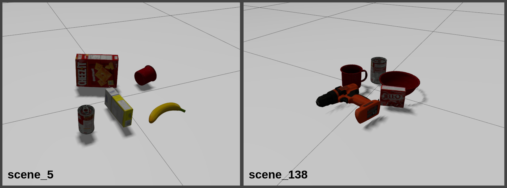

# mnet_scenes_gazebo

## ROS 2 Jazzy package for importing ManipulationNet scenes into Gazebo

This package provides a simple way to load predefined ManipulationNet scenes into Gazebo using ROS 2 Jazzy. The scenes provided are selected from ManipulationNets Grasping In Clutter benchmarking exercise found [here.](https://manipulation-net.org/tasks/grasping_in_clutter.html)

### These are some example scenes of objects in Gazebo:


---

## Installation
Clone the package into your ROS 2 workspace:

```
cd ~/ros2_ws/src
git clone https://github.com/JohnBrann/mnet_scenes_gazebo.git
```

## Build

```bash
source /opt/ros/jazzy/setup.bash
cd ~/ros2_ws
colcon build && source install/setup.bash
```
## Usage

Select which scene to load by editing the configuration file at: **`config/scene.yaml`** Available scenes are listed in **scenes/metadata.json**

Also choose where in the world to spawn the objects by changing the spawn position values, these are Gazebo x,y,z world coordinates

```yaml
scene_number: 5
spawn_location:
  x: 0.0
  y: 0.0
  z: 0.0

```


Launch the selected scene in Gazebo

```
ros2 launch mnet_scenes_gazebo create_scene.launch.py
```

## Using more scenes

In this repository we provided 18 example scenes from ManipulationNet for initial testing. We selected 10 scenes categorized as 'easy', 5 scenes categorized as 'medium', and 3 scenes caterorized as 'hard'. 

**Descriptions of difficulty categories are here**
- **Easy:** "the objects are sparsely arranged" 
- **Medium:** "the objects are placed very close to each other"
- **Hard:** "the objects could stack on each other"

**For the example scenes we also selected we tried to avoid scenes that included:**
- The clamp and scissors due to physical grasp difficulty in Gazebo
- 'Hard' scenes with many objects stacked on top of each other due to Gazebo's contact physics difficulties.


To use other ManipulationNet scenes, acquire the .npz file for the desired scene [here](https://github.com/ManipulationNet/mnet_client/tree/ros_2/assets/grasping_in_clutter/scenes) and paste it into the 'scenes' folder.

**Scene ratings are as followed:**
Scenes 0-99 are 'easy'. Scenes 100-199 are 'medium'. Scenes 200-299 are 'hard'
